### Using tools for development
    * React
    * material UI
    * material UI Icons
    * x-data-grid
    * formik
    * yup
    * fullcalendar for calendar
    * nivo for pie, bar, line and geography chart
    * custom theme for design

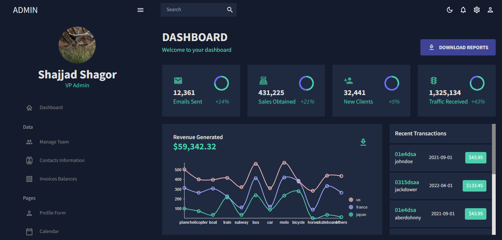
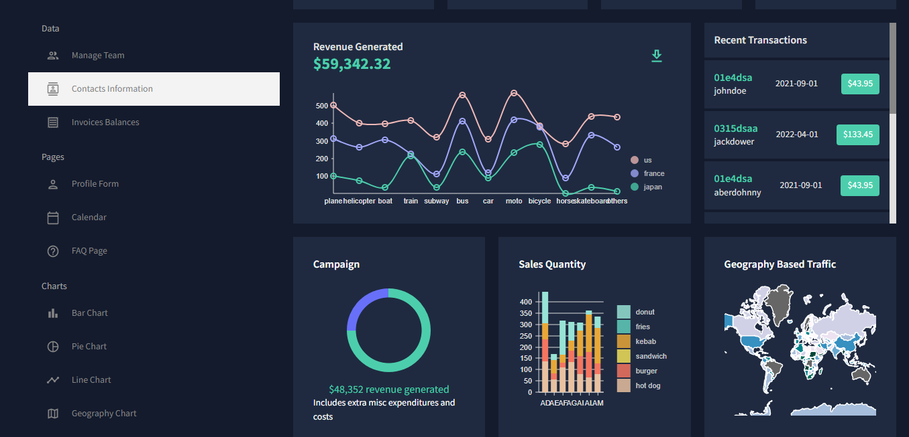
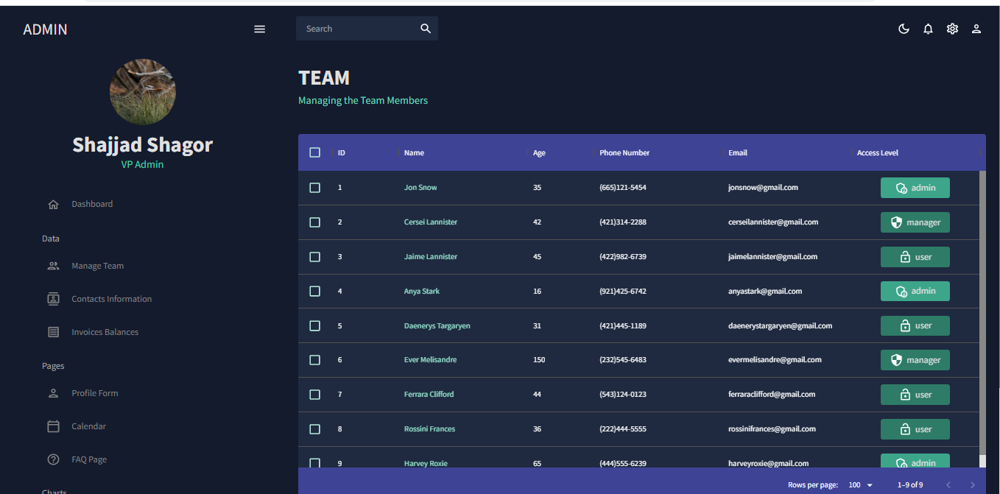
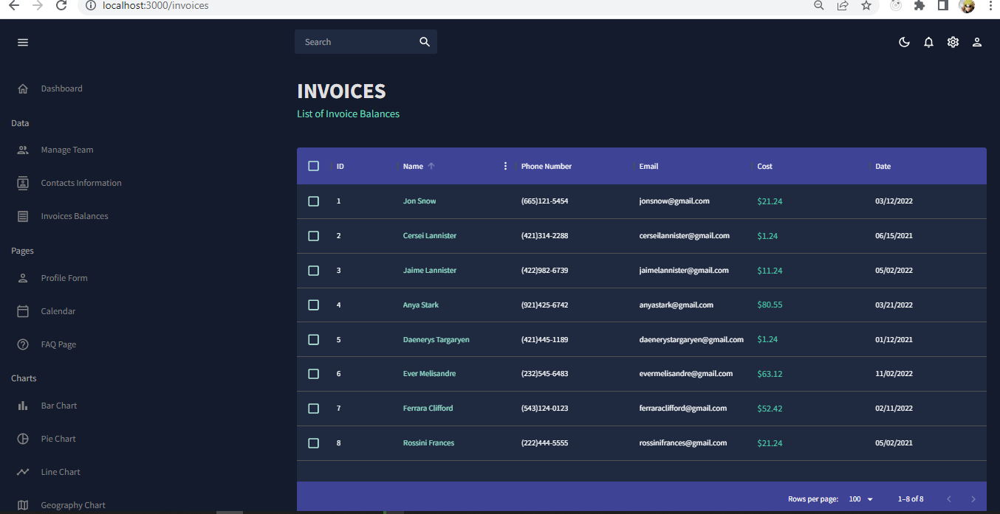
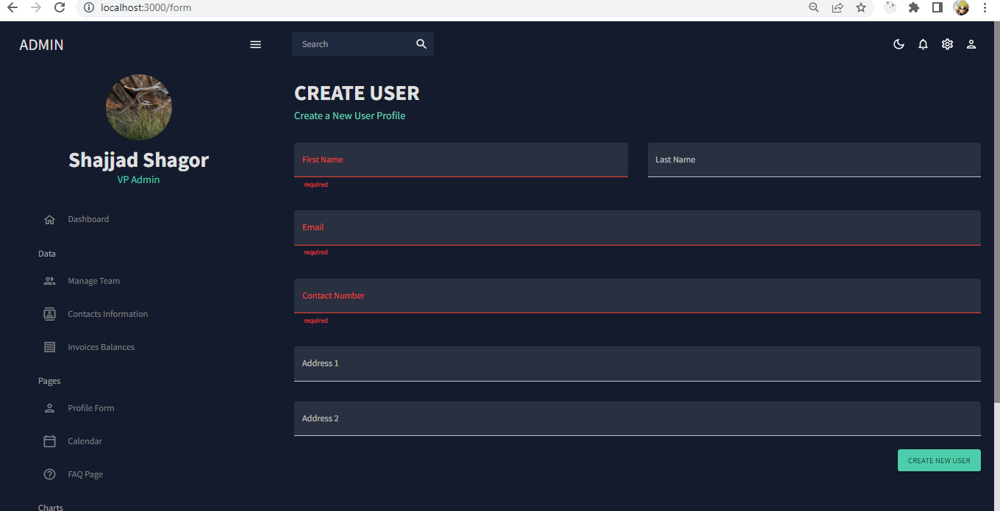
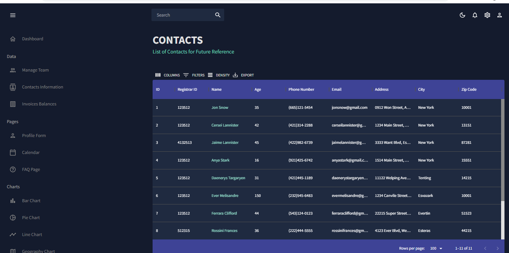
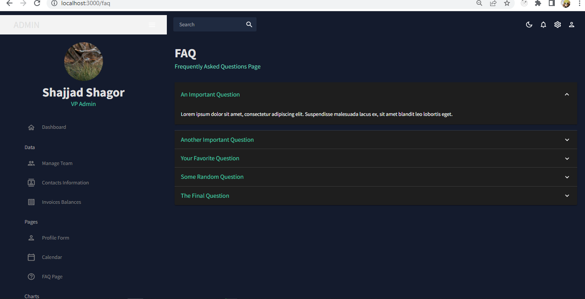
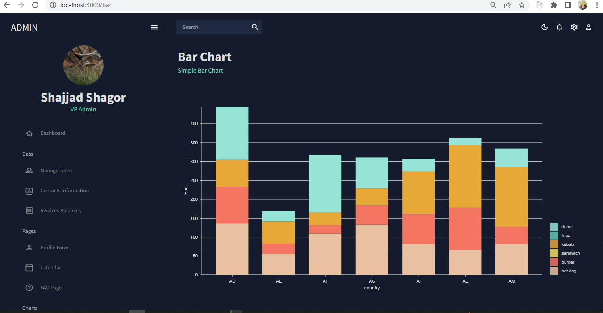
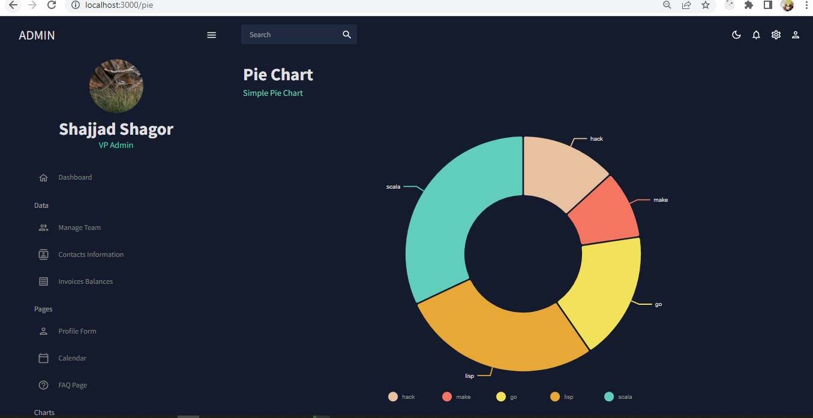
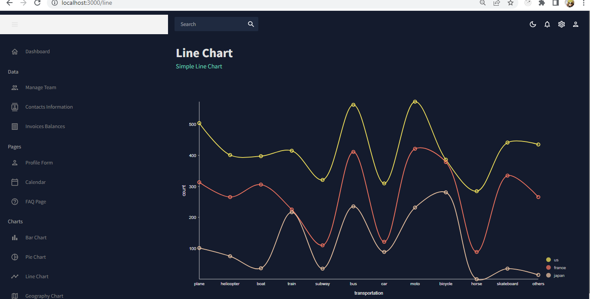
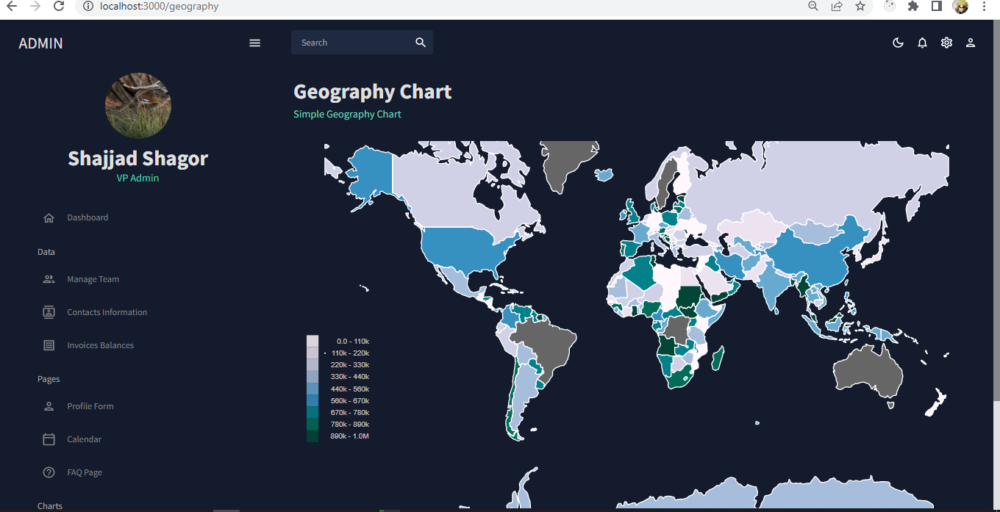